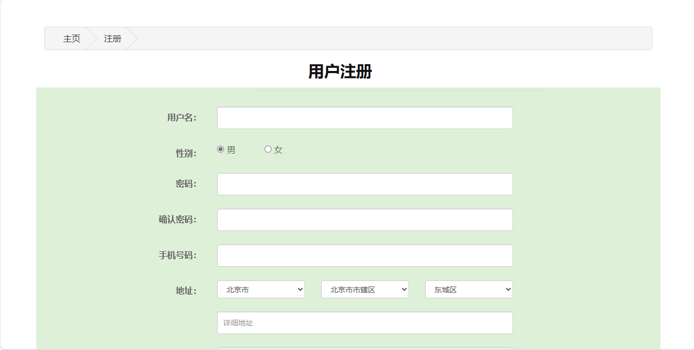
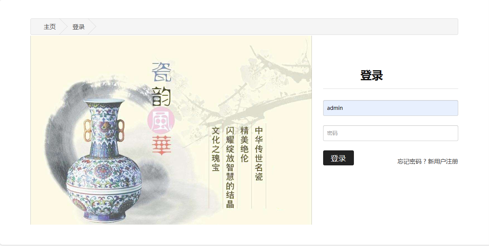
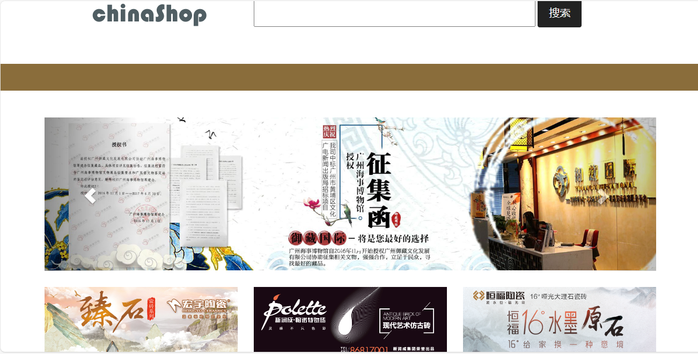
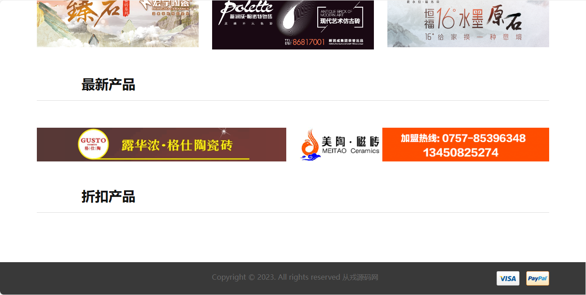
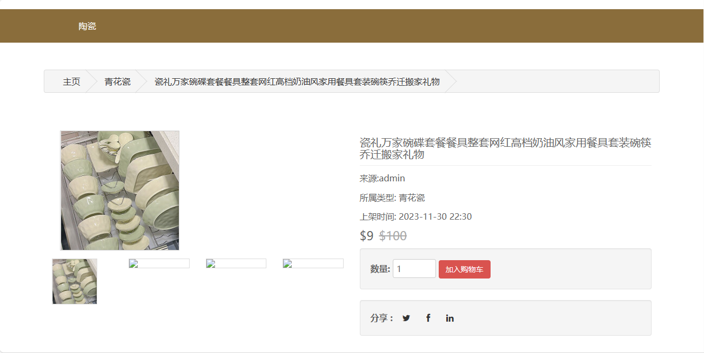
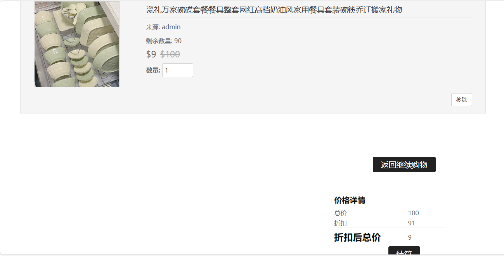
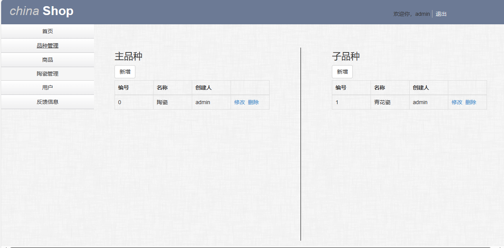
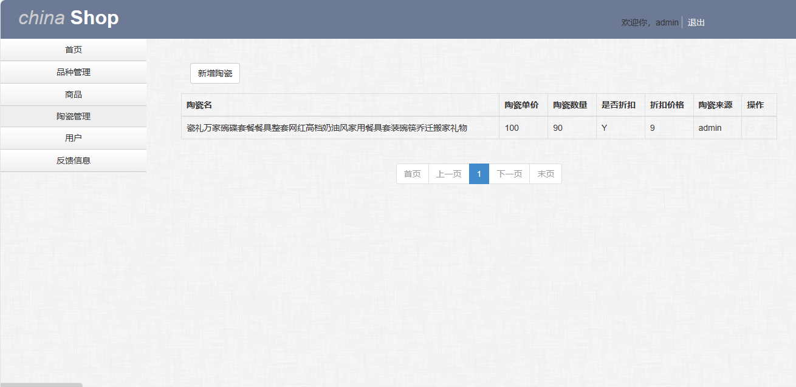
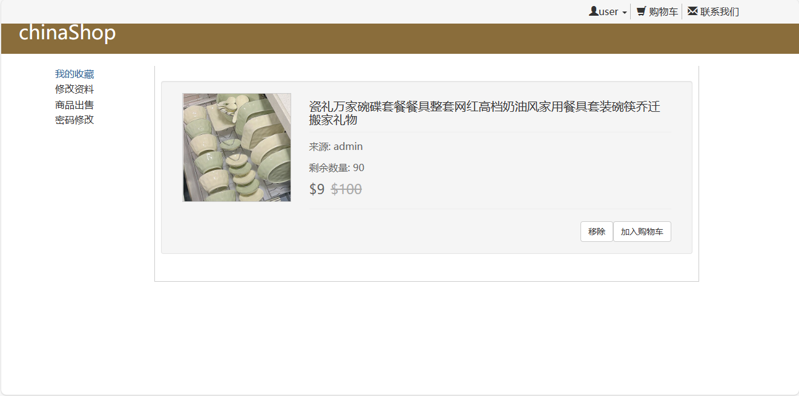

<h1 align="center">39.基于ssm的中国陶瓷购物管理系统</h1>

 获取sql文件 QQ: 386869957 QQ群: 377586148 

 [推荐站点: 从戎源码网](https://armycodes.com/) 

## 简介

> 本代码来源于网络,仅供学习参考使用!
> 
> 访问地址：http://localhost:8080/
> 管理员：admin 123456
> 用户：user 123456
>

## 项目介绍
基于ssm的中国陶瓷购物管理系统：前端jsp、jquery、bootstrap，后端 spring、mybatis，集成陶瓷商品浏览、陶瓷商品详情、购物车、陶瓷品种管理、陶瓷管理等功能于一体的系统。

## 功能介绍

### 管理员

- 品种管理：主品种列表、新增主品种、主品种修改、主品种删除、子品种列表、新增子品种、子品种修改、子品种删除
- 陶瓷管理：新增陶瓷、陶瓷编辑、陶瓷商品删除、陶瓷商品图片上传
- 管理员授权：用户列表、授权用户操作
- 店铺审核：店铺列表，审核操作
- 用户管理：用户列表，密码重置
- 反馈信息：反馈信息列表、信息待处理、信息处理

### 用户

- 基本功能：登录、注册、退出
- 核心功能：首页轮播图、栏目展示、最新商品、折扣产品、商品收藏、商品详情、加入购物车、购物车列表、结算
- 用户中心：我的收藏、收藏商品展示、修改资料、商品出售、密码修改
- 其它功能：留言、评价、联系我们

## 环境

- <b>IntelliJ IDEA 2009.3</b>

- <b>Mysql 5.7.26</b>

- <b>Tomcat 7.0.73</b>

- <b>JDK 1.8</b>

## 运行截图

